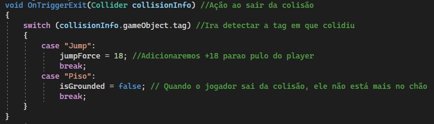

# Jogo do Astronauta

<a href="https://youtu.be/GNJCFnRgIXw" target="_blank">Clique aqui para assistir ao jogo</a>

<a href="https://drive.google.com/drive/folders/1aRXR83QR8oAexbKWf9EYqxdAwfOsTy51?usp=sharing" target="_blank">Clique aqui para baixar e jogar</a>

### Autores
Davi dos Santos Nascimento e João Lucas dos Anjos Pinto

Esta cena foi criada com o intuito de aprendermos as colisões: Static collider, Rigidbody Collider, Kinematic Rigidbody Collider, Static Trigger Collider, Rigidbody Trigger Collider, onde conseguimos aplicar isso em nossa cena de maneira bem intuitiva.

## Player:
Utilizamos um Astronauta como Player onde emsi já possuium Capsule Collider e um Rigidbody como deve ser feito, além disso, implementamos a ele os scripts necessários para o desenrolar da cena.

      
      

## Cenário
Ao longo do cenário colocamos diversas plataformas e desafios para o jogador percorrer

### Componentes do cenário

    

## Códigos usados:
Aqui estaremos mostrando alguns dos códigos essenciais para realização do projeto. Onde criamos e colocamos os Scripts no Player, para que as colisões ocorrecem da maneira correta, precisariamos detectar os objetos (através de suas tag's) que estariam em colisão e assim executar uma função dependendo do contexto, a partir dai conseguimos executar os tipos de colisões solicitadas.

 
 
 

